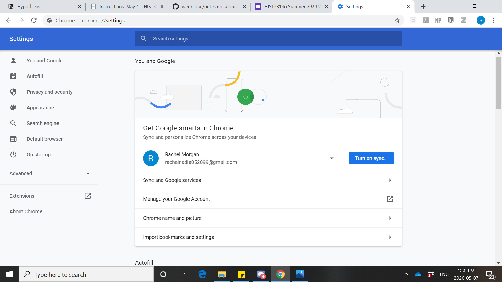
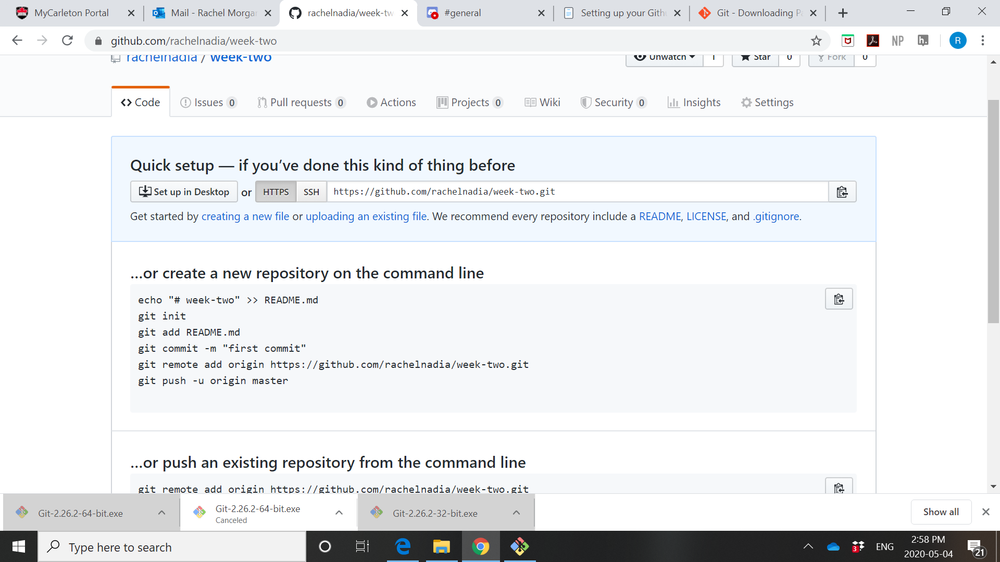
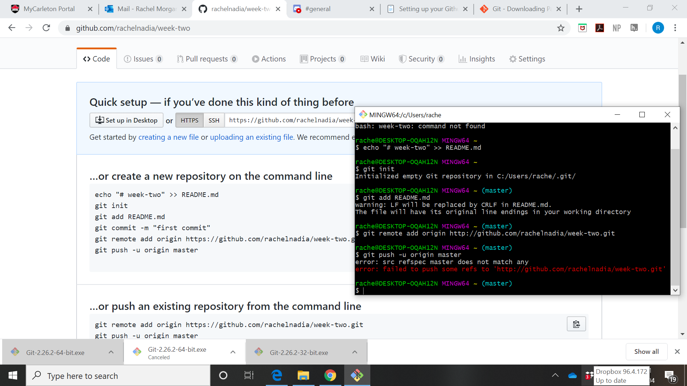
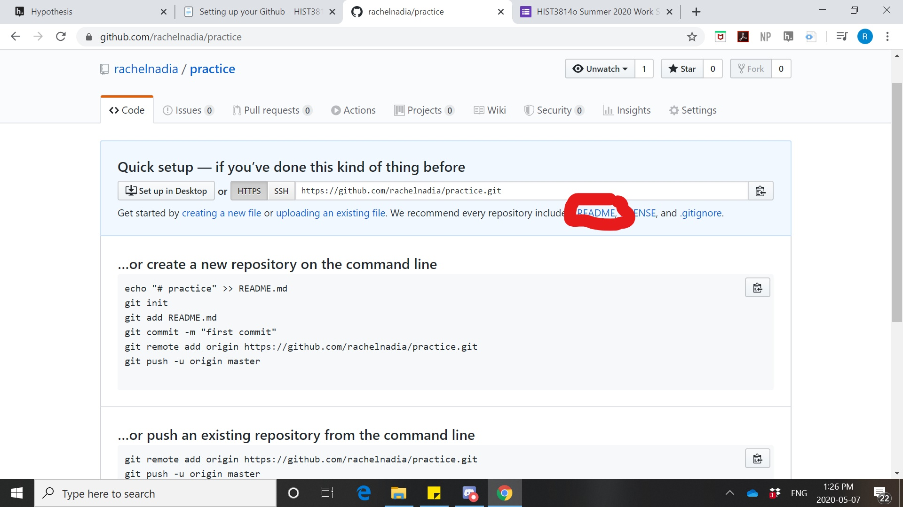

# Reflection for Week One

This first week working with the materials for HIST3814O was nothing short of an experience. To start, I'd like to give you a brief rundown of who I am and why I'm here. I think it will help provide context to some of my further analysis.
I am going into my fourth year of journalism with a combined honours in geography and a minor in history. 
One thing I feel like I have fallen short on in my acedemic experience, is becoming proficient in using technology.
However, each time a course brings up a new digital tool or database, I enjoy learning how to use it.
That is why I am excited to be here. I am excited to expand my skills using digital tools to help me with research and in other areas of academia.

## Introduction to the Digital Tools

Starting right from the basics, I realized that Chrome is the browser I needed to use to use all of the extensions for this course, but also to be more successful in other areas of research. I am slightly ashamed to admit that I always use to use Microsoft Edge. However, I am now aware of the potential of Chrome and will continue to use it exclusively in the future.
Before I could start with any of the digital tools, I played around with my Chrome settings.

Luckily, I found this pretty simple to do!

### Hypothesis

I had never heard of hypothesis before. I found it simple to download and to join our class group. I played around with the tool a bit on different websites and articles and found it very useful to be able to highlight and provide annotations. I like the way that these annotations can be public. I think it gives an excellent advantage to collaboration on academia. 

### Discord

I already had a discord account that I use as a social media platform with my friends. Thus, joining our class group did not give me any difficulty.

### Zotero

Zotero is by far my favourite digital tool I learned about this week. I downloaded both th extension for Chrome and the desktop app. I love how it simplifies saving all reasearch into one spot, and it provides all bibliographical informaiton! I am going to continue to use Zotero in the future for all assignments in this class, other classes, and throughout my future career. I plan on taking some time to explore the desktop app for Zotero further to experiment with creating different folders to save research for different assignments separately.

### Github

Github is where I ran into trouble. I followed the directions on the syllabus for al setup, but when creating my repository for week two I forgot to initialize it.
Just as the instructions showed, I ran into this:

I tried to follow the instructions in the syllabus for fixing this. I ended up with a code box and copied the code in as such:

However, I ended up with an error and nothing on my Github changed.
I decided to give it a bit of a break. When I returned later, I played around with some of the features on Github. I realized I needed to click on README in order to copy the error code from the command line.

Luckily, this worked and I was successful in initializing this repository.

Overall, I ran into few issue this week setting up these digital tools. I find each one very useful in its own unique way and look forward to exploring each one further on my own time.

## Introduction to Digital History

Okay, so I will admit that I did not really read the description for this course before registering in it. I assumed it would be a theoretical course studying important people and projects in digital history. I did not realize that we would be learning about how to use digital tools in order to be able to produce digital history. I am glad however, that the course is what is is and not what I expected. 

Before looking at the material for this week, I thought digital history was the way in which the history was researched. I didn't think of the side of repurposing historical work for the digital relam. I think this is a very important aspect that has relavence to most disciplines in the present day.

One concept from the readings that struck with me is the idea of open access. In the modern day, producing works of digital history make them more accessible. No longer is the work about who produced it at what institution, rather who has access to it and who will benefit from the work. I think this has a lot of relavence to the modern day especially right now when everyone is isolated due to COVID-19. Digitization not only changes what we have access to, but it also changes the way we read works. Digitization in different forms with different images and texts can provide a different tone than physical works. I think this is an important realization of what can be done online.

However, one quote that I latched onto was from Robert Darnton in the article "History Can Be Open Source: Democratic Dreams and the Rise of Digital History". He said, "Yes, we must digitize. But more important, we must democratize". The democratization of historical work breaks down different sociological barriers that limit access to works.

This links to the article on women in digital history. Not only is access to work limited, but credit for works is not being given. 
